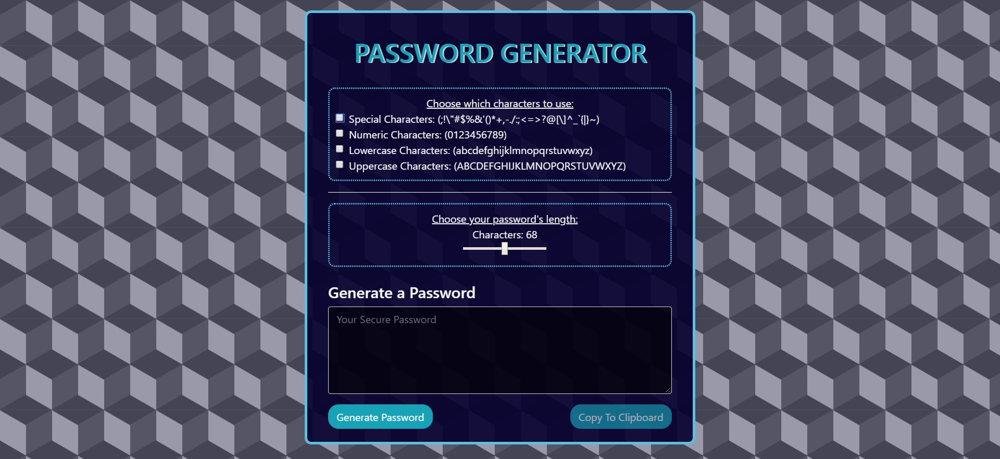
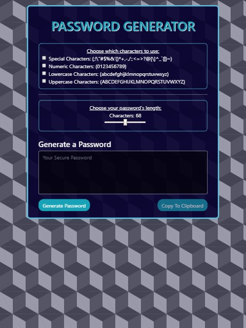
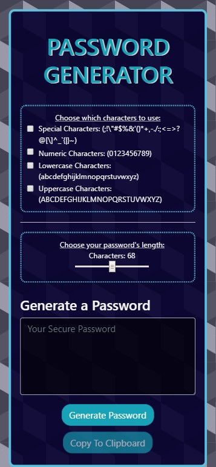

# Password Generator

## Description
* I have developed a user-friendly Javascript-based application that generates a random password based on user inputs
* Checkboxes are implemented to designate what kind of characters to use (Special Characters, Numbers, Uppercase Letters, and Lowercase Letters).
* The user chooses the length of their password (8-128 characters) using a slider  
* The program generates a random password of the selected length using `Math.random()` and the user-selected character set. 
* You can copy this password to your clipboard by clicking the button that says **_"Copy To Clipboard"_**. 

### Javascript used

* **Functions**
* **If/Else Loop**
* **For Loop**
* **getElementById**
* **classList.remove**
* **onclick Event**
* **oninput Event**

### Screenshots
* Laptop Screen

* Ipad Screen
 
* Iphone Screen

### URL
If you want to check out my Password Generator, **[Click Here](https://alexcoulter.github.io/password-generator/)**
